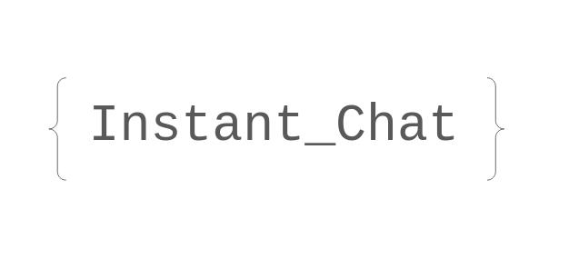

# Instant_Chat



This is a simple WebApplication for instant communication using websockets.

A running example here https://msgxchange.xyz

## Philosophy

The server does not make use of cookies to authenticate users after their connection, but rather of a randomly temporary password authentication mechanism. 

So, everytime the user get out of the website, he is disconnected.

And he has to click only on the website link to go back for example if he does not want to be disconnected.

Because the server does not communicate an authentication cookie, and that pasing a password by URL is not secure, each time the user connects to the account, a temporary random password is generated only available for next connection on the next page. When he connects to the next page, the same mechanism is applied until the user get out of the website. 

# Setting Up the server

## Database

Using `MySQL (5.7+)` or `Mariadb (10.5+)`

```
CREATE DATABASE chat_app;
CREATE TABLE credentials (username VARCHAR(15), password VARCHAR(16), temp_password TINYTEXT);
CREATE TABLE chat_room (name VARCHAR(15));
```

## AES key

Modify the default `secret_key` in `main.go` (must be 32 of characters)

This key is used to cipher the random temporary password.

## Users

Banned users are stored in the slice `banned_usernames`.

To only authorize certain usernames, set `only_usrs` to `true` and add the authorized usernames in the slice `only_usernames`.

## Deploying with NGINX and https

If you want to deploy outside of your local network, follow these steps:

Make sure to add the following header in `location` block for the websocket connection.

```
proxy_set_header Upgrade websocket;
proxy_set_header Connection Upgrade;
```

In `templates/chat.html`

change `const socket = new WebSocket("ws://{{.ServerIP}}:{{.ServerPort}}/ws/{{.ChatRoom}}{{.NextURL}}");`

to `const socket = new WebSocket("wss://your_domain_name/ws/{{.ChatRoom}}{{.NextURL}}");`


